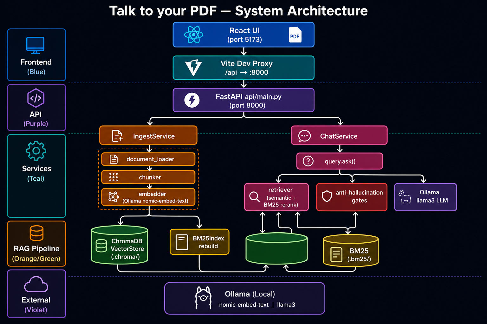
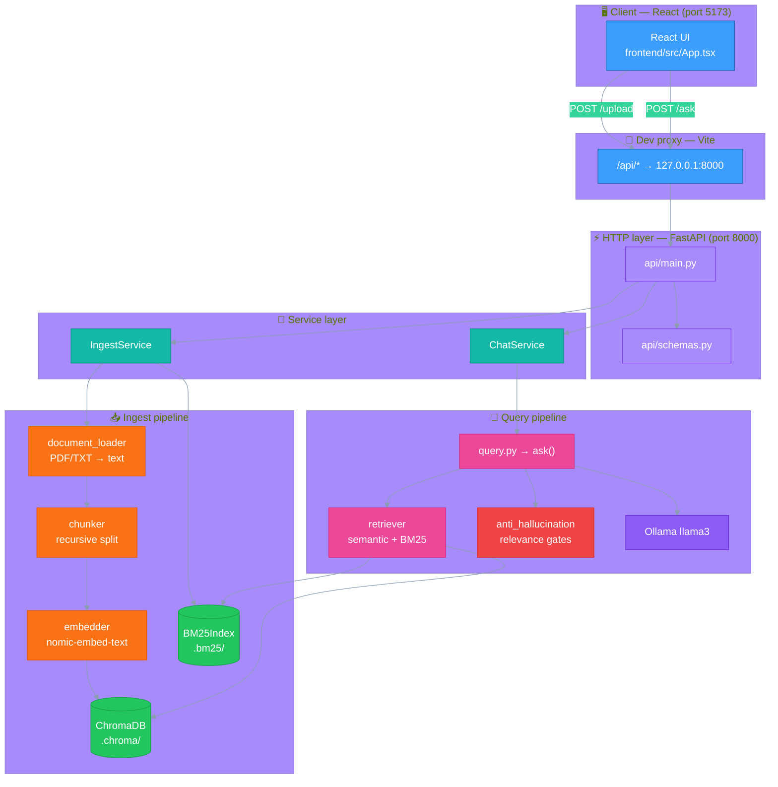
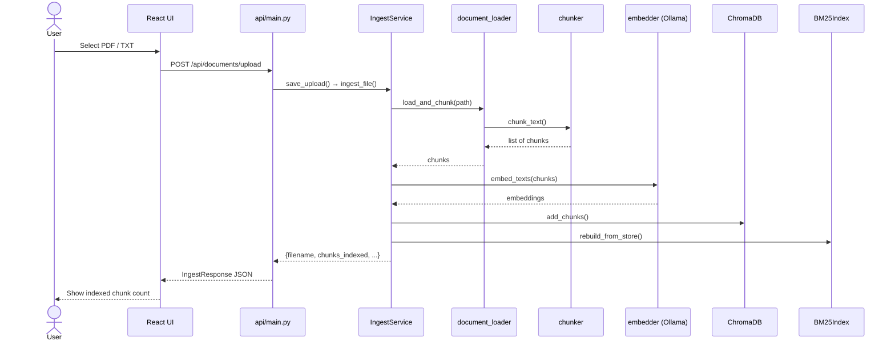
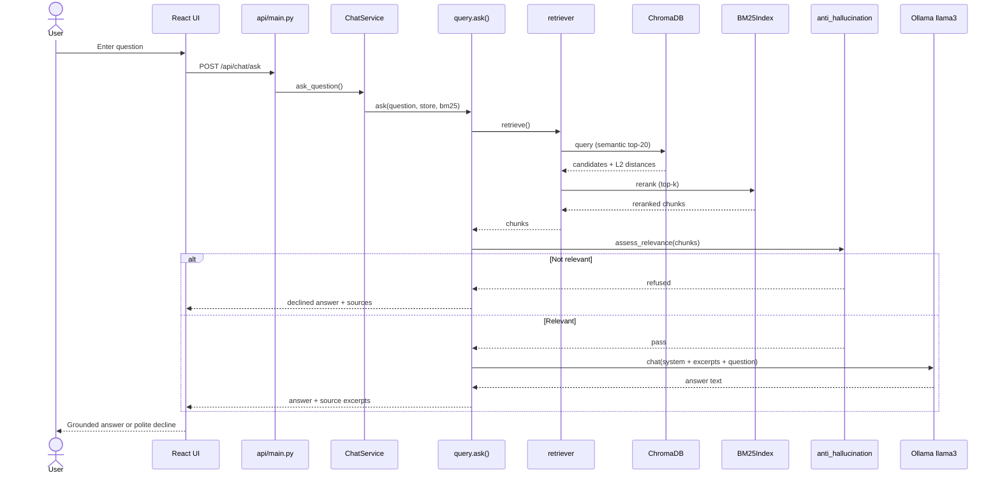
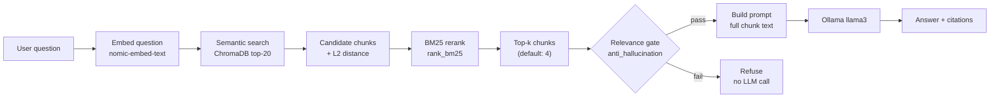
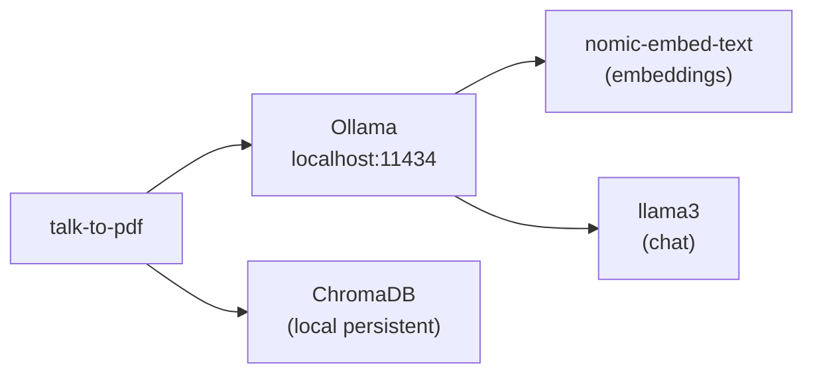

# Architecture — Talk to your PDF

## System overview (color diagram)



## System overview (Mermaid)



## Layer responsibilities

| Layer | Files | Responsibility |
|-------|-------|----------------|
| UI | `frontend/src/*` | Upload PDF, ask questions, show answers + source excerpts |
| HTTP | `api/main.py`, `api/schemas.py` | REST routes, validation, JSON responses, CORS |
| Services | `rag/services/*` | Glue between FastAPI and RAG; shared `VectorStore` |
| Ingest | `document_loader`, `chunker`, `embedder`, `vector_store`, `bm25_index` | Extract → chunk → embed → index |
| Retrieve | `retriever.py` | Hybrid search: semantic top-20 → BM25 rerank → top-k |
| Answer | `query.py`, `anti_hallucination.py` | Relevance gate → LLM prompt → grounded response |

## Shared state wiring

Both services share the same in-memory `VectorStore` instance, created once in `api/main.py`:

```python
ingest_service = IngestService()
chat_service = ChatService(store=ingest_service.store)
```

On-disk indexes (`.chroma/`, `.bm25/`) persist across restarts. After upload or reset, the API reloads `BM25Index` so chat sees fresh data.

---

## Upload flow (ingestion)



---

## Ask flow (RAG + anti-hallucination)



---

## Hybrid retrieval detail



### Relevance gate thresholds (`rag/config.py`)

| Setting | Purpose |
|---------|---------|
| `STRONG_SEMANTIC_DISTANCE` (280) | L2 distance below this → auto-pass |
| `MAX_SEMANTIC_DISTANCE` (450) | L2 distance above this → refuse |
| `MIN_BM25_SCORE` (0.5) | Borderline semantic match needs keyword overlap |

> ChromaDB returns **L2 distance** (typically 150–350 in-document, 550+ off-topic), not a 0–1 cosine score.

---

## Project layout

```
talk-to-pdf/
├── frontend/                 # React SPA (port 5173)
│   └── src/api.ts            # fetch → /api/*
├── api/
│   ├── main.py               # FastAPI routes
│   └── schemas.py            # Request/response models
├── rag/
│   ├── config.py             # Models, chunk size, thresholds
│   ├── document_loader.py    # PDF/TXT extraction
│   ├── chunker.py            # RecursiveCharacterTextSplitter
│   ├── embedder.py           # Ollama embeddings
│   ├── vector_store.py       # ChromaDB wrapper
│   ├── bm25_index.py         # BM25 build / rerank / persist
│   ├── retriever.py          # Hybrid retrieval orchestration
│   ├── anti_hallucination.py # Relevance gates
│   ├── query.py              # ask(), prompt, LLM call
│   └── services/
│       ├── ingest_service.py
│       └── chat_service.py
├── main.py                   # CLI (same RAG pipeline)
├── data/sample-policy.txt
├── .chroma/                  # Vector DB (gitignored)
└── .bm25/                    # BM25 index (gitignored)
```

## External dependencies


